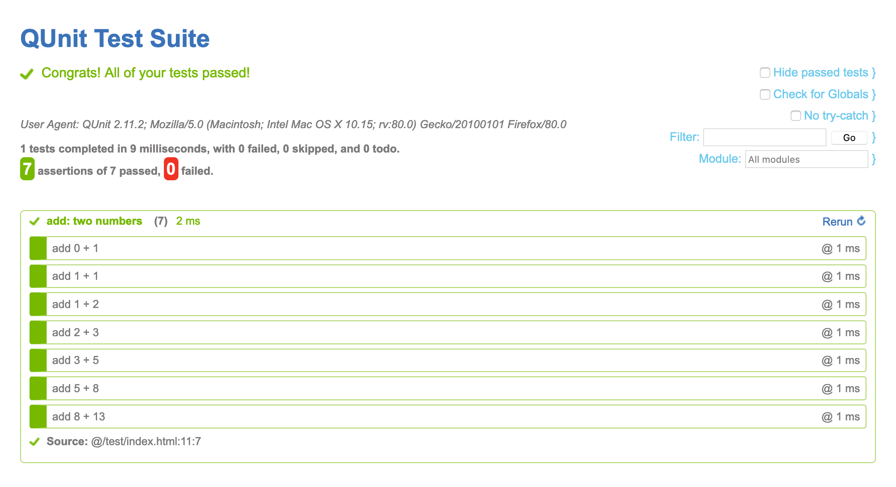
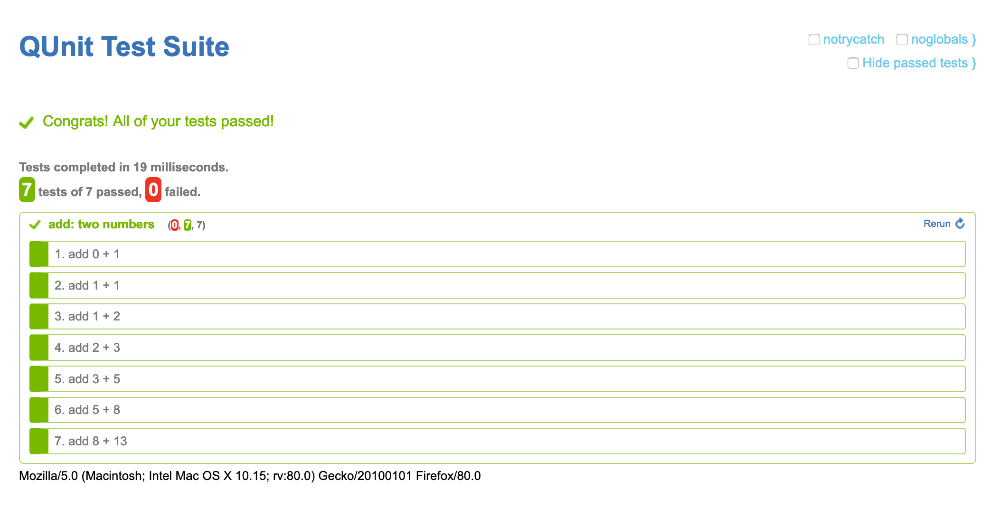

# QUnit Gabe Theme

## Usage

1. Install this plugin (either as git submodule, as npm dependency, or otherwise)
2. Remove `<link rel="stylesheet" href="qunit/qunit.css">`
3. Add `<link rel="stylesheet" href="qunit-theme-gabe/qunit-theme-gabe.css">`

## Demo

See [`test/index.html`](https://krinkle.github.io/qunit-theme-gabe/test/) for a demo.

## Visual history

### qunit-theme-gabe 2.0.0 (2020)

### QUnit 1.3.0 (2012)

Original version as designed by Gabe Hendry, as bundled with QUnit 1.3.0 in 2012. [qunitjs/qunit#188](https://github.com/qunitjs/qunit/pull/188)

